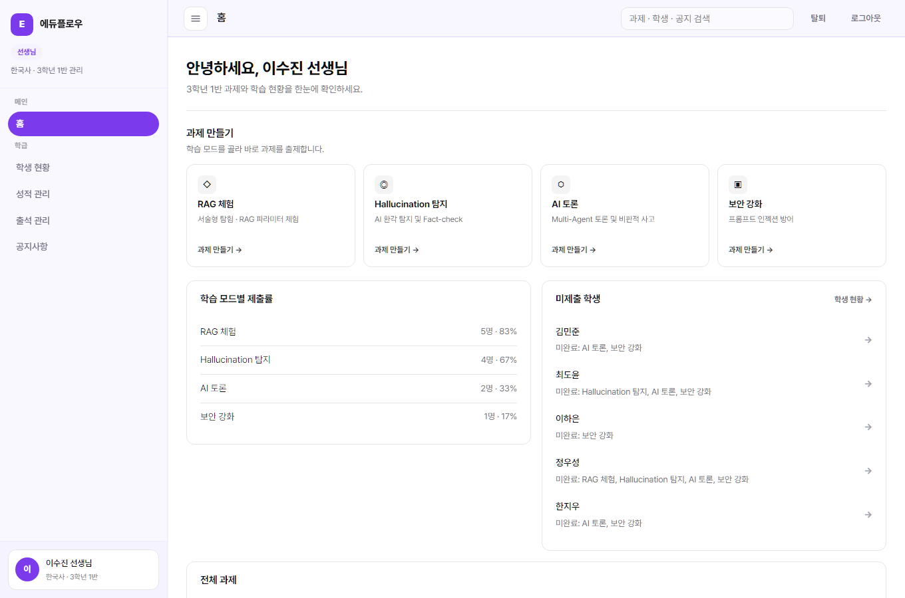
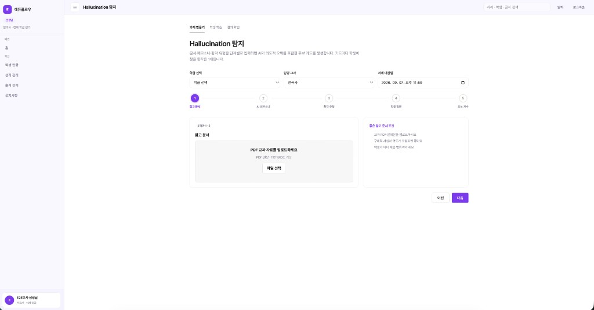
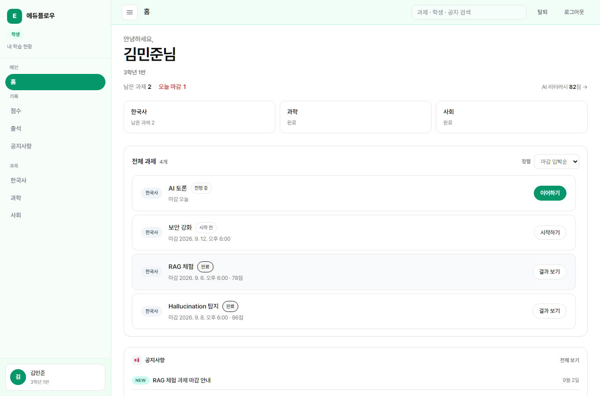
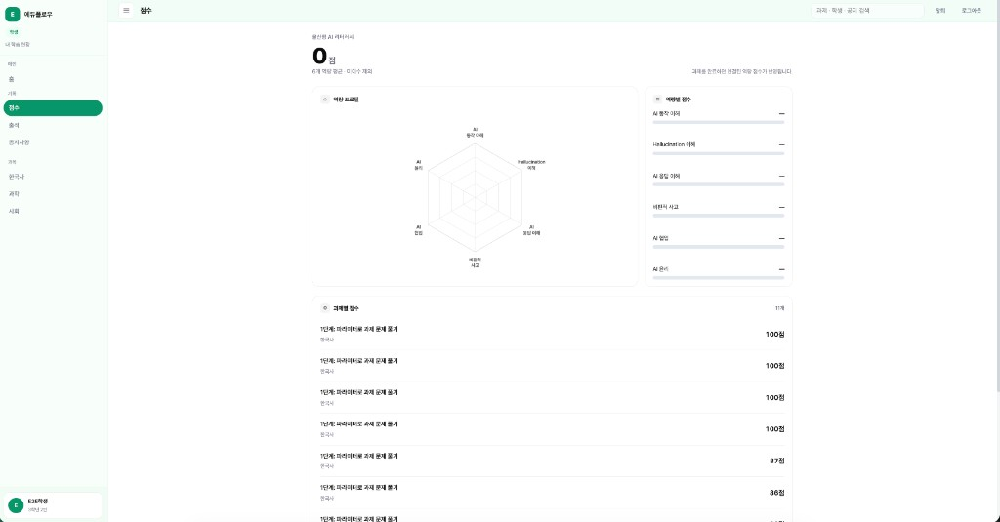

<div align="center">

# EduFlow Frontend

중·고등학생 **AI 리터러시** 교육 플랫폼 **에듀플로우**의 웹 UI입니다.  
교사(출제·학급 관리)와 학생(Stage 1~4 학습) 화면을 React로 구현합니다.

[](https://react.dev/)
[](https://vite.dev/)
[](https://www.typescriptlang.org/)
[](https://reactrouter.com/)

## 주요 화면

<table>
  <tr>
    <th width="50%">선생님 홈</th>
    <th width="50%">선생님 Stage 2 출제</th>
  </tr>
  <tr>
    <td width="50%" valign="top">
      
    </td>
    <td width="50%" valign="top">
      
    </td>
  </tr>
  <tr>
    <th width="50%">학생 홈</th>
    <th width="50%">학생 점수</th>
  </tr>
  <tr>
    <td width="50%" valign="top">
      
    </td>
    <td width="50%" valign="top">
      
    </td>
  </tr>
</table>

</div>

## 빠른 시작

```bash
# 1. 저장소 클론
git clone https://github.com/eduflow-team/frontend.git
cd frontend

# 2. 환경 변수 파일 생성
cp .env.example .env

# 3. 의존성 설치
npm install

# 4. 개발 서버 실행
npm run dev

# 5. 브라우저 접속
open http://localhost:5173
```
